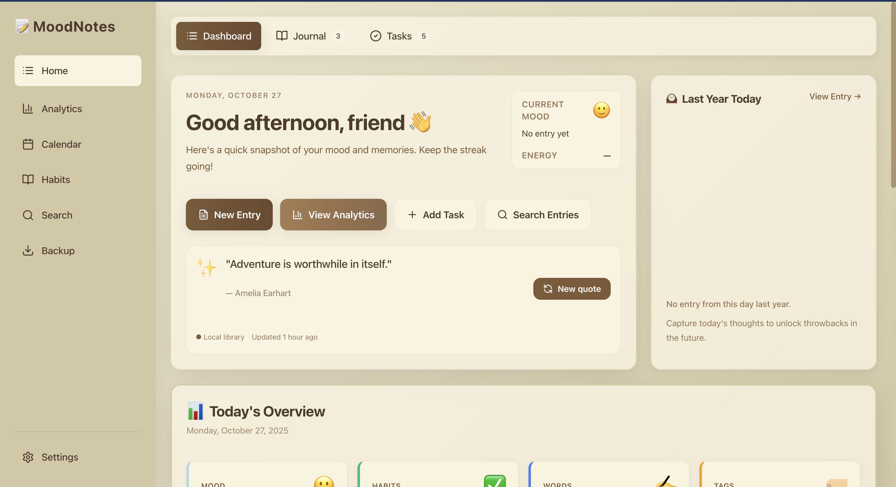

<div align="center">
  
</div>

# MoodsNote · v1.0.0

<div align="center">

[简体中文](./README.md) | English

</div>

Let your days and moods have a warm place to rest.


MoodsNote is a local-first journaling app built with Vue 3 + Vite and Electron. It turns "writing it down" into something gentle, effortless, and powerful: daily summaries and sparks, mood trends and habit insights, offline storage with one-click backup/import. What matters isn't the features—it's the honest conversation between you and your life.

— For those who live with intention.

## Contents

- [Highlights](#highlights)
- [Screenshots](#screenshots)
- [Install & Run](#install--run)
- [Build & Test](#build--test)
- [Data & Privacy](#data--privacy)
- [Tech Stack](#tech-stack)
- [Project Structure](#project-structure)
- [FAQ](#faq)
- [Contributing](#contributing)
- [License](#license)
- [Changelog](#changelog)

## Highlights

- Writing experience
  - Daily Summary: rich text editor (Quill), weather and mood, tags and custom sections, comfort-zone notes
  - Sparks: capture thoughts instantly—faster, lighter, closer
  - Media library: image/video/audio saved and read locally
  - Export: JSON / CSV / Markdown (PDF planned)

- Time & views
  - Calendar view: see daily mood, todos, and quote at a glance
  - This Day Last Year: look back to the same date one year ago

- Insights & habits
  - Mood trend, energy/stress curves, monthly word count (Chart.js visualizations)
  - Habit tracking and trend insights, today’s habit completion

- Local-first & backup
  - All journal data in IndexedDB (via LocalForage), fully offline-ready
  - One-click export/import with versioned format and conflict preview (preview, merge, replace)

- Experience & accessibility
  - Extensible keyboard shortcuts, virtual list and lazy loading, light/dark themes
  - Better a11y: focus trap, keyboard reachability, semantic aria labels

## Screenshots

<div align="center">
  
  
</div>

<div align="center">
  
  
</div>

<div align="center">
  
</div>

## Install & Run

Requirements
- macOS / Windows / Linux
- Node.js 18+

Local development
1. Install dependencies
   ```bash
   npm install
   ```
2. Start dev (Vite + Electron together)
   ```bash
   npm run dev
   ```
   A hot-reload environment will be started for both the renderer (Vite) and Electron main process.

Preview built frontend
```bash
npm run preview
```

## Build & Test

- Production build (frontend + Electron TypeScript compile)
  ```bash
  npm run build
  ```

- Package as application (after installing electron-builder)
  ```bash
  npm install  # Install dependencies first
  npm run package        # Auto-detect current platform
  npm run package:mac    # Package for macOS .dmg
  npm run package:win    # Package for Windows .exe
  npm run package:linux  # Package for Linux AppImage/deb
  ```
  Build artifacts will be output to `dist-electron/` directory.

- Tests
  ```bash
  npm run test       # run unit tests (Vitest)
  npm run test:ui    # interactive UI mode
  npm run test:coverage
  ```

## Data & Privacy

- Local data storage
  - Structured data (day summaries, tasks, habits, sparks, calendar entries) is persisted in IndexedDB (via LocalForage)
  - Backup export includes a version field and export timestamp; supports JSON/CSV/Markdown

- Media files (Electron)
  - Storage path: `app.getPath('userData')/media`
  - Limits: single file ≤ 10MB, total ≤ 100MB; allowed extensions: `.jpg/.jpeg/.png/.gif/.webp/.mp4/.webm/.ogg/.mp3/.wav`

- Backup & migration
  - Import performs structure validation and conflict preview; strategies include Merge/Replace/Skip
  - Backup files are versioned (current backup format is 2.0.0) and older formats are migrated on import

We keep everything on your device whenever possible, and provide clear, controllable ways to export.

## Tech Stack

- Frontend: Vue 3, TypeScript, Vite, Tailwind CSS, Vue Router, Vuex 4, Vue I18n
- Visualization: Chart.js, chartjs-plugin-zoom, vue-chartjs
- Editing: Quill, DOMPurify (content security)
- Data: LocalForage (IndexedDB persistence)
- Desktop: Electron 33 (contextIsolation, secure preload bridge)
- Others: vue-virtual-scroller, jspdf (reserved for PDF support)

## Project Structure

```
.
├── electron/                # Electron main process and preload
│   ├── main.ts              # BrowserWindow, media IPC, storage limits
│   ├── preload.ts           # Securely expose APIs to renderer
│   └── package.json         # Electron build scripts
├── src/
│   ├── App.vue
│   ├── main.ts              # Vite entry
│   ├── components/          # Backup, insights, charts, theme, virtual list, etc.
│   ├── composables/         # Backup, migration, shortcuts, performance, etc.
│   ├── i18n/                # Localization (zh / en)
│   ├── router/              # Routes
│   ├── store/               # Vuex with runtime type guards
│   ├── utils/               # Utilities (formatters, performance monitor, error handler)
│   └── views/               # Pages (Home, Settings, Analytics, DaySummary)
├── public/
├── vite.config.ts
├── vitest.config.ts
├── tailwind.config.js
└── package.json
```

## FAQ

- No installer output?
  - This version doesn’t include an installer packager yet. Run in Electron via `npm run dev`, or open a PR with electron-builder/forge integration.

- Import failed or some items got dropped?
  - Import validates structure and filters invalid entries with type guards. Use “Preview” to inspect conflicts and data quality, then pick a suitable strategy.

- Media exceeds limits?
  - Single file ≤ 10MB, total ≤ 100MB. Regularly export backups and clean up unused media.

## Contributing

All kinds of contributions are welcome—copy, design, performance, usability, i18n, and more.

1. Fork the repo
2. Create a branch
   ```bash
   git checkout -b feature/your-feature
   ```
3. Commit your changes
   ```bash
   git commit -m "feat: your message"
   ```
4. Push and open a PR
   ```bash
   git push origin feature/your-feature
   ```

## License

AGPL-3.0. See [LICENSE](./LICENSE).

## Changelog

- v1.0.0 (First public release)
  - Core journal/spark/media/calendar experience
  - Charts: mood trend, energy/stress, word count
  - Habit tracking and insights
  - Backup export/import with versioned format and conflict preview
  - Local-first, offline-ready; i18n (zh / en) and light/dark themes

— Crafted with care by [PStarH](https://github.com/PStarH) and contributors.
